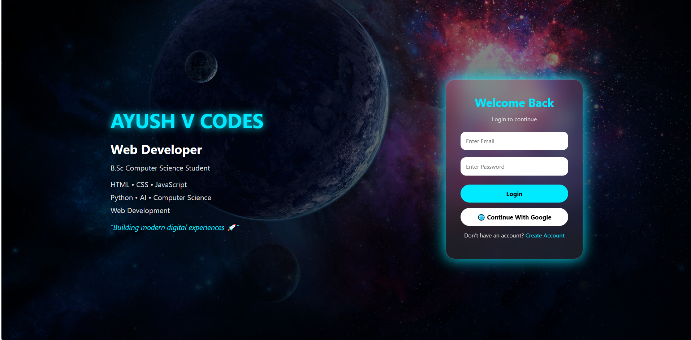

# 🚀 AYUSH V CODES - Login System

A modern and responsive **Space Theme Login & Signup System** built using HTML, CSS, and JavaScript.

This project features a premium glassmorphism UI with a galaxy background and a developer portfolio-style landing page.

---

## 🌐 Live Website

🔗 **Live Demo:**  
https://ayush-v-codes-login-system.netlify.app/

---

## 💻 Source Code

🔗 **GitHub Repository:**  
https://github.com/codesbyayushv/Login-System

---

## 🌌 Preview



---

## 🚀 Features

✅ Modern Space UI Design  
✅ Login Page  
✅ Create Account Page  
✅ Dashboard Page  
✅ Password Show/Hide Feature  
✅ Local Storage Based Authentication  
✅ User Profile Display  
✅ Logout System  
✅ Mobile Responsive Design  

---

## 🛠️ Technologies Used

- HTML5
- CSS3
- JavaScript
- LocalStorage
- VS Code

---

## 📂 Project Structure

```text
Login-System
│
├── index.html
├── signup.html
├── dashboard.html
├── style.css
├── script.js
│
└── assets
    ├── bg.jpg
    ├── logo.png
    └── screenshot.png
👨‍💻 About Developer

AYUSH V CODES

Web Developer | B.Sc Computer Science Student

Skills:
HTML
CSS
JavaScript
Python
AI
Computer Science
Web Development
🔥 Future Improvements
Firebase Authentication
Google Login
GitHub Login
User Database
Profile Management
⭐ Support

If you like this project, consider giving it a ⭐ on GitHub.

Made with ❤️ by AYUSH V CODES
